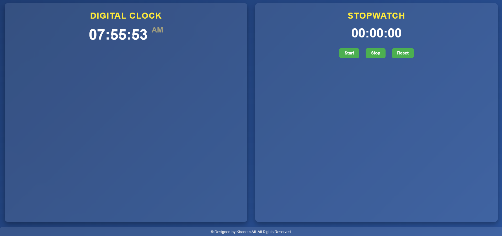

# Digital Clock & Stopwatch

A modern, responsive **Digital Clock** and **Stopwatch** built with **HTML**, **CSS**, and **JavaScript**. This project features:
- A digital clock with AM/PM functionality.
- A simple stopwatch with start, stop, and reset buttons.
- A visually appealing and responsive layout using **Glassmorphism** and **Flexbox**.

---

## Features
- **Digital Clock**: Displays the current time in **HH:MM:SS** format with an AM/PM toggle.
- **Stopwatch**: Features start, stop, and reset functionalities with time formatted as **HH:MM:SS**.
- **Modern Design**: Glassmorphism effects, vibrant colors, and a minimalist UI.
- **Responsive Layout**: The clock and stopwatch sections are arranged side by side on larger screens and stack on smaller devices.
- **Dynamic Copyright**: Automatically displays the current year in the footer.

---

## Screenshots


*Screenshot of the Digital Clock & Stopwatch interface.*

---

1. **Clone the repository**:

   ```bash
   git clone https://github.com/mdkhademali/digital-clock-stopwatch.git

